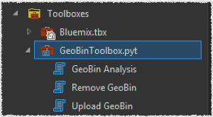
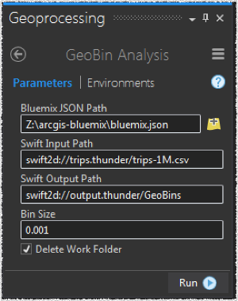

# GeoBinning On IBM Bluemix Spark

This is a proof of concept project to enable [ArcGIS Pro](https://pro.arcgis.com/en/pro-app/) to invoke a [Spark](https://console.ng.bluemix.net/catalog/services/apache-spark) based geo analytics on [IBM Bluemix](https://www.ibm.com/cloud-computing/bluemix/what-is-bluemix) and view the result of the analysis as features in a map.


The analysis is a simple square binning in [PySpark](http://spark.apache.org/docs/2.1.0/programming-guide.html), where the input is a set of 1 million [NYC Taxis trip records](http://www.nyc.gov/html/tlc/html/about/trip_record_data.shtml) placed in [Bluemix Object Store](https://console.ng.bluemix.net/catalog/services/object-storage).  The result of the analysis is streamed back to Pro using the [python swiftclient](https://docs.openstack.org/developer/python-swiftclient/) library to be visualized in a map frame.

## Setup Bluemix

After creating a [Bluemix Account](https://console.ng.bluemix.net/registration/), 2 services have to be created:

- An [ObjectStore](https://console.ng.bluemix.net/docs/services/ObjectStorage/index.html) service.
- A [Spark](https://console.ng.bluemix.net/docs/services/AnalyticsforApacheSpark/index.html) service.

The following is a sample dashboard setup:


Unzip the [sample trips file](https://dl.dropboxusercontent.com/u/2193160/trips-1M.csv.zip) and upload it to a container in ObjectStore.


Locate the Storage service credentials and the Spark service credentials:


Save both JSON documents in a file named `bluemix.json` that is sibling to the `GeoBinToolbox.pyt` file.

The following is a sample content of `bluemix.json`.  Please note the top level `storage` and `spark` keys whose values are the service credentials documents:

```
{
  "storage": {
    "username": "xxx",
    "role": "admin",
    "projectId": "xxx",
    "password": "xxx",
    "domainName": "xxx",
    "userId": "xxx",
    "project": "xxx",
    "domainId": "xxx",
    "auth_url": "https://identity.open.softlayer.com",
    "region": "xxx"
  },
  "spark": {
    "tenant_secret": "xxx",
    "plan": "ibm.SparkService.PayGoPersonal",
    "tenant_id_full": "xxx",
    "instance_id": "xxx",
    "tenant_id": "xxx",
    "cluster_master_url": "https://spark.bluemix.net"
  }
}
```

## Binning Spark Job

The binning job is performed by submitting to the cluster the PySpark based `GeoBin.py`. Check out the section [Using spark-submit](https://console.ng.bluemix.net/docs/services/AnalyticsforApacheSpark/index-gentopic4.html#using_spark-submit) on how to submit a spark job manually.  The following is a sample execution:

```
./spark-submit.sh\
 --vcap vcap.json\
 --deploy-mode cluster\
 --conf spark.service.spark_version=2.0\
 --conf spark.service.user.fs.swift2d.impl=com.ibm.stocator.fs.ObjectStoreFileSystem\
 --conf spark.service.user.fs.swift2d.service.thunder.auth.method=keystoneV3\
 --conf spark.service.user.fs.swift2d.service.thunder.auth.endpoint.prefix=endpoints\
 --conf spark.service.user.fs.swift2d.service.thunder.auth.url=https://identity.open.softlayer.com/v3/auth/tokens\
 --conf spark.service.user.fs.swift2d.service.thunder.region=xxx\
 --conf spark.service.user.fs.swift2d.service.thunder.tenant=xxx\
 --conf spark.service.user.fs.swift2d.service.thunder.username=xxx\
 --conf spark.service.user.fs.swift2d.service.thunder.password=xxx\
 --conf spark.service.user.fs.swift2d.service.thunder.public=true\
 --conf spark.service.user.input.path=swift2d://trips.thunder/trips-1M.csv\
 --conf spark.service.user.output.path=swift2d://output.thunder/GeoBins\
 --conf spark.service.user.cell.size=0.001\
 --name GeoBin\
 GeoBin.py
```

The `vcap.json` file contains the Spark service credentials. The Storage credentials are passed as `--conf` parameters where the keys are prefixed with `spark.service.user.` in such that then can be passed to the master per [Properties and variables for spark-submit](https://console.ng.bluemix.net/docs/services/AnalyticsforApacheSpark/index-gentopic4.html#spark-submit_properties).  The application strips the prefix `spark.service.user.` from the configuration keys and uses the striped keys and their associated values to setup the Hadoop configurations in the job. In addition, the term `thunder` in the above example is used as a "marker" string between the `swift2d` input and output paths and the storage service credentials. Any string term could have been used as a marker. Finally, `spark-submit.sh` is not the "traditional" script that comes with Apache Spark. You have to explicitly download it from <https://spark.bluemix.net/batch/spark-submit.sh> and it uses a "hidden" REST API to upload a job resource, submit a job, check on the job status, and download the job stderr/stdout for job postmortem analysis.  The `GeoBinToolbox.pyt` uses this "hidden" API to programmatically submit a job to Bluemix and then view the result of the job as download features on the map.

## Setup ArcGIS Pro

Run as administrator the `Python Command Prompt` from `Start` > `ArcGIS` > `ArcGIS Pro`, and install the [python-swiftclient](https://www.swiftstack.com/docs/integration/python-swiftclient.html) packages:

```
pip install python-swiftclient
pip install python-keystoneclient
```

Note: Could not find a way to `conda install` these packages for Windows within Pro.  If someone figured it out successfully, please tell me.

Next, add the `GeoBinToolbox.pyt` to the project:


## GeoBinToolbox

This [ArcPy](http://pro.arcgis.com/en/pro-app/arcpy/get-started/what-is-arcpy-.htm) based toolbox consists of 3 public facing tools: `Upload GeoBin`, `Remove GeoBin` and `GeoBin Analysis`.



### Upload GeoBin


This tools takes 2 parameters:

- The path to `bluemix.json`
- The path to `GeoBin.py`

It uses the credentials in `bluemix.json` to upload the content of `GeoBin.py` onto your Spark Bluemix instance for future use when submitting a job.  This upload needs to be performed once.

### Remove GeoBin


This tool removes from your Spark Bluemix instance the uploaded `GeoBin.py` file.

### GeoBin Analysis



This tools accepts the following parameters:

- The path to `bluemix.json`
- The swift path to NYC trips records
- The swift path to analysts output
- The bin size in decimal degrees (note to self, change that to meters)
- An option to remove the ephemeral work directory in your Spark Bluemix instance.

When the user clicks on the `Run` button, the tool will submit a Spark job using the REST API referencing the uploaded `GeoBin.py` and configured with the input parameters.  Then every 7 seconds, it continuously checks the status of the job. Once the job is finished successfully, it will iterate of all the `part` files in the output swift container and will stream their content back to be parsed and appended to an ephemeral feature class.  The feature class is then rendered and symbolized on the map.

### References

- <https://developer.ibm.com/clouddataservices/2016/01/15/real-time-sentiment-analysis-of-twitter-hashtags-with-spark/>
- <https://github.com/plouc/mozaik>
- <https://document-conversion-demo.mybluemix.net/>
- <https://github.com/ibm-cds-labs/ibmos2spark>
- <http://intermediatepythonista.com/python-generators>
- <http://docs.ceph.com/docs/jewel/radosgw/swift/python/>

### Notes To Self

```
conda install -c anaconda-platform python-swiftclient
```

```
conda create --name my-env --clone arcgispro-py3
```

```
activate my-env
```
